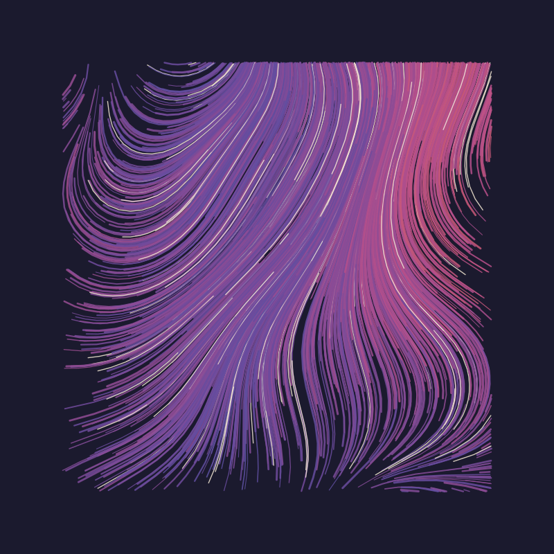
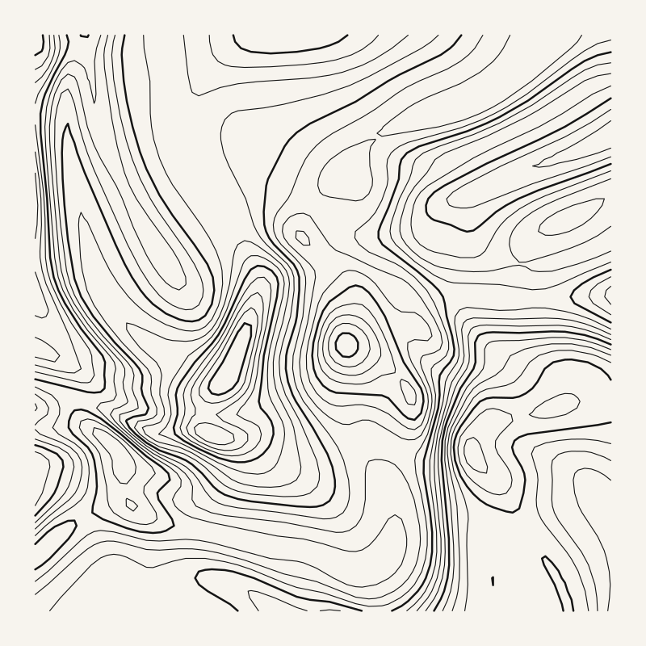
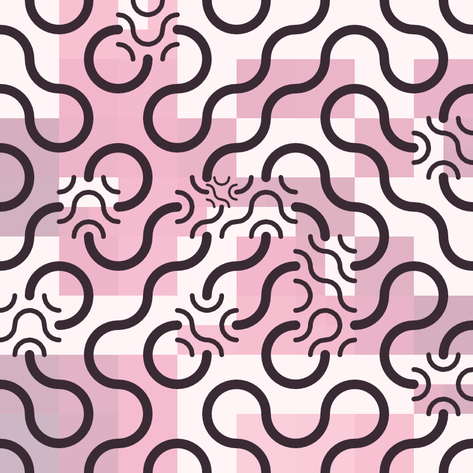
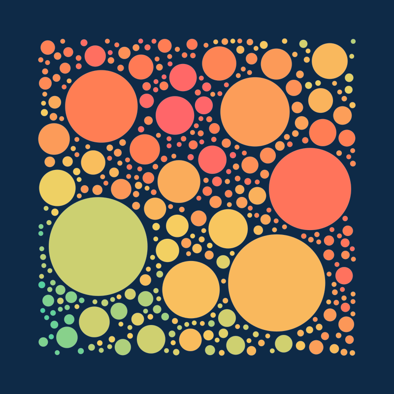
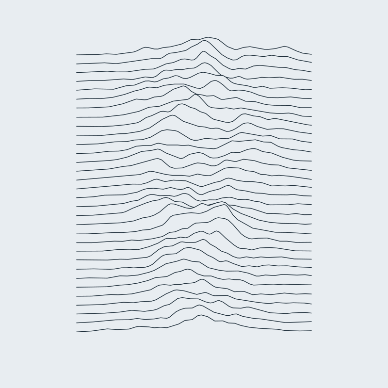
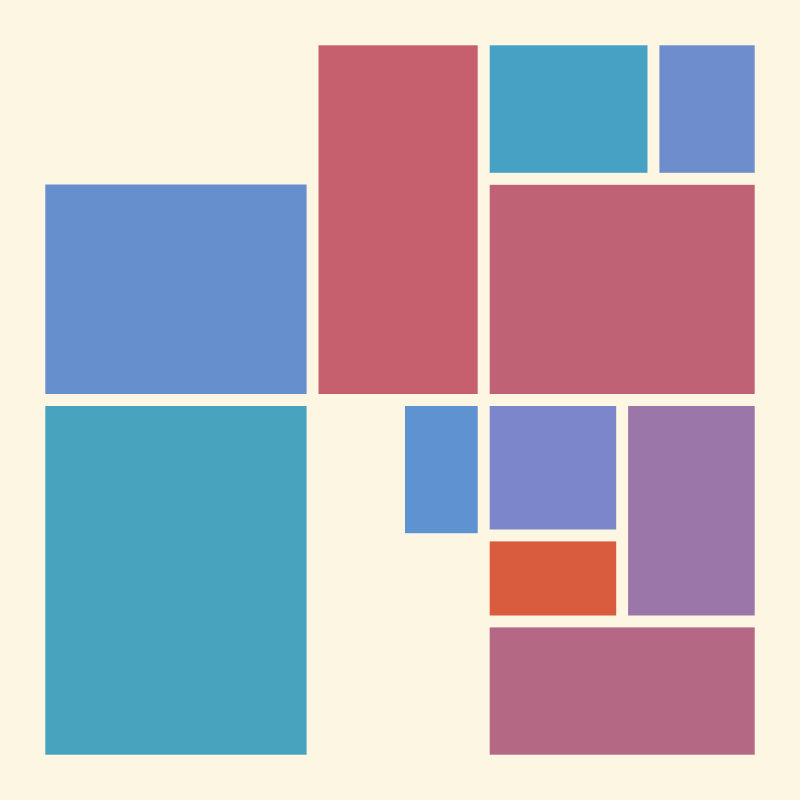

<p align="center">
  
</p>

<h1 align="center">nacre</h1>

<p align="center">
  Generative art from a single seed. Written in Go with zero dependencies.<br>
  SVG out, PNG out, and a playground in the browser via WebAssembly.
</p>

<p align="center">
  <a href="https://devatobuild.github.io/nacre/"><strong>Open the playground</strong></a> ·
  <a href="#install">Install</a> ·
  <a href="#use-it-from-go">Library</a> ·
  <a href="#write-your-own-style">Write a style</a>
</p>

<p align="center">
  <a href="https://github.com/devatobuild/nacre/actions/workflows/ci.yml"></a>
  <a href="https://pkg.go.dev/github.com/devatobuild/nacre"></a>
  <a href="https://goreportcard.com/report/github.com/devatobuild/nacre"></a>
  <a href="LICENSE"></a>
</p>

---

A seed is a complete recipe. `0x3f1a` is the flow field above, and it will be the same flow field on any machine, in any year. Words work too: `"sea glass"` hashes to its own piece.

## Gallery

<table>
  <tr>
    <td></td>
    <td></td>
    <td></td>
  </tr>
  <tr>
    <td align="center"><b>flow</b> <code>0x3f1a</code> dusk</td>
    <td align="center"><b>contour</b> <code>0x7e11</code> ink</td>
    <td align="center"><b>truchet</b> <code>0xb10c</code> sakura</td>
  </tr>
  <tr>
    <td></td>
    <td></td>
    <td></td>
  </tr>
  <tr>
    <td align="center"><b>circles</b> <code>0xc0ffee</code> reef</td>
    <td align="center"><b>ridges</b> <code>0x5ea</code> tundra</td>
    <td align="center"><b>blocks</b> <code>0x90d</code> solar</td>
  </tr>
</table>

| Style | What it draws |
| --- | --- |
| `flow` | Particles traced through layered simplex noise, as hairlines or ribbons, sometimes with a vortex. |
| `contour` | Topographic isolines of a domain-warped landscape, extracted with marching squares and stitched into continuous paths. |
| `truchet` | Quarter-circle tiles, recursively subdivided, that join into endless winding paths. |
| `circles` | Circle packing coloured by a slow noise tide, as discs, nested rings or ink dots. |
| `ridges` | Stacked noise horizons that hide one another, the way mountain ranges do. |
| `blocks` | Golden-ratio subdivision into blocks, some plain, some hatched or dotted. |

Ten palettes ship with it: `dusk`, `ember`, `ink`, `moss`, `nacre`, `noir`, `reef`, `sakura`, `solar` and `tundra`.

## Install

Download a binary for macOS, Linux or Windows from the [releases page](https://github.com/devatobuild/nacre/releases), or build it with Go 1.24 or newer:

```sh
go install github.com/devatobuild/nacre/cmd/nacre@latest
```

## Use the command line

<p align="center"></p>

```sh
nacre render                                         # a surprise, saved as <style>-<seed>.svg
nacre render -style flow -seed 0x3f1a -palette dusk  # exactly the hero above
nacre render -seed "sea glass" -animate              # strokes draw themselves in when opened
nacre render -style contour -o map.png -scale 2      # 2400 × 2400 PNG
nacre render -width 3000 -height 1000 -density 0.6   # any aspect ratio
nacre gallery -per 3 -out gallery                    # three pieces of every style
nacre palettes                                       # colour swatches in your terminal
```

The seed decides the style and palette unless you pick them, and picking them never changes the drawing's shapes. So you can find a composition you like and then try it in every palette.

## Use it from Go

```go
import (
	"os"

	"github.com/devatobuild/nacre"
	_ "github.com/devatobuild/nacre/styles" // registers the built-in styles
)

func main() {
	piece, err := nacre.Render(nacre.Options{Style: "flow", Seed: 0x3f1a, Palette: "dusk"})
	if err != nil {
		panic(err)
	}
	os.WriteFile("flow.svg", piece.SVG(nacre.SVGOptions{Simplify: 0.4, Animate: true}), 0o644)

	f, _ := os.Create("flow.png")
	defer f.Close()
	piece.Canvas.WritePNG(f, 2) // two pixels per canvas unit
}
```

## Write your own style

A style is a function. It gets a canvas, a random stream and a palette, and must take all of its randomness from that stream. Register it, and it works everywhere: in `Render`, on the command line, and in the playground.

```go
nacre.Register(nacre.Style{
	Name: "orbits",
	Info: "Concentric rings with a little wobble.",
	Draw: func(c *nacre.Canvas, r *nacre.Rand, p nacre.Params) {
		u := c.Unit()
		for i := 0; i < int(30*p.Density); i++ {
			radius := u * (0.05 + 0.4*float64(i)/30)
			wobble := u * r.Range(0, 0.01)
			pts := make([]nacre.Point, 0, 120)
			for k := 0; k < 120; k++ {
				a := 2 * math.Pi * float64(k) / 119
				pts = append(pts, c.Center().Polar(radius+wobble*math.Sin(6*a), a))
			}
			c.Stroke(pts, p.Palette.At(float64(i)/30), u*0.002)
		}
	},
})
```

Size things relative to `c.Unit()`, the canvas's shorter side, and the piece will look the same at any resolution.

## How it works

Everything is written from scratch on the standard library.

- **Randomness.** `Rand` is xoshiro256\*\* seeded through SplitMix64. `Render` forks three independent streams from the seed: one picks the style, one picks the palette, one draws. That is why fixing the palette by hand leaves the shapes alone.
- **Noise.** The `noise` package implements 2D and 3D simplex noise, fractional Brownian motion and ridged multifractal noise.
- **Canvas.** Styles draw paths and circles onto a resolution-independent canvas. Nothing is rasterized until you ask for it.
- **SVG.** Paths are simplified with Ramer–Douglas–Peucker and written with trimmed precision, which keeps a 2,000-stroke flow field under 300 KB. The draw-in animation is pure CSS with `stroke-dashoffset`, so it plays inside a plain `` tag, including on GitHub. It respects `prefers-reduced-motion`.
- **PNG.** A small anti-aliased rasterizer. Strokes and circles use exact signed-distance coverage. Polygons use a non-zero-winding scanline fill with vertical supersampling and exact horizontal coverage. Each shape is accumulated into a coverage mask before blending, so translucent strokes never double up where their segments overlap.
- **Contours.** Marching squares with saddle disambiguation. Cell segments are linked through shared edges into long polylines, so each isoline is one path rather than thousands of fragments.
- **Playground.** The same Go code compiled to WebAssembly. The page keeps the seed, style and palette in the URL, so every piece has a link.

## Develop

```sh
make test      # tests, including determinism checks for every style
make lint      # gofmt, go vet, staticcheck
make bench     # render benchmarks
make serve     # build the playground and serve it on localhost:8080
make gallery   # re-render a gallery
make demo      # rebuild docs/demo.svg from real CLI output
```

Releases are cut by pushing a `v*` tag. GitHub Actions builds binaries for six platforms and attaches them with checksums.

## License

[MIT](LICENSE)
